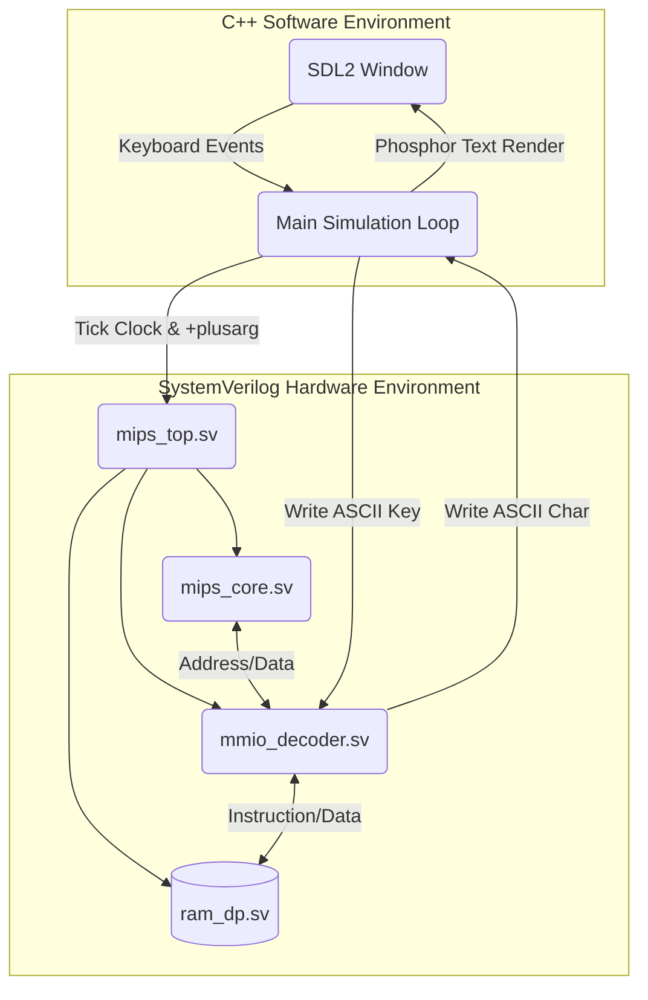
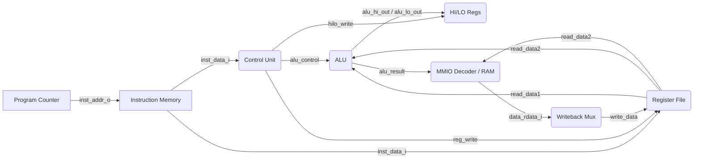

# double-l32 Architecture Overview

## 1. System Architecture (Component Diagram)

The overall system bridges hardware simulation (via Verilator) and software I/O (via SDL2/C++). The `sim/main.cpp` wrapper handles window events and ticks the hardware clock.



## 2. Core CPU Architecture (Datapath)

The `mips_core.sv` module follows a classic single-cycle datapath, extended with custom support for HI/LO registers and parameterized shifts.



## 3. Keyboard Echo Flow (Sequence Diagram)

This sequence illustrates what happens when a user types a key on their physical keyboard while the emulator is running.

```mermaid
sequenceDiagram
    participant User
    participant SDL2 as C++ Wrapper (SDL2)
    participant Core as MIPS CPU Core
    participant MMIO as MMIO Decoder
    
    User->>SDL2: Presses 'H' Key
    SDL2->>SDL2: Maps to ASCII 0x48
    SDL2->>MMIO: Writes 0x48 to mmio_keys_i (0x10001000)
    
    loop Every Clock Cycle
        Core->>MMIO: LW $t3, 0($t1) (Read 0x10001000)
        MMIO-->>Core: Returns 0x48
        
        Core->>Core: BNE $t3, $zero, proceed (Key detected!)
        
        Core->>MMIO: SW $t3, 0($t2) (Write 0x48 to 0x10000000)
        MMIO->>SDL2: mmio_screen_we_o is asserted!
        SDL2->>SDL2: Buffers 'H' into screen.data[0][0]
    end
    
    SDL2->>User: Renders Phosphor 'H' on Window

## 4. Dynamic ROM Loading Flow (Startup Sequence)

This diagram shows how a custom machine code binary is injected into the hardware simulation at runtime.

```mermaid
sequenceDiagram
    participant OS as Host OS Shell
    participant Run as double-l32-run (Wrapper)
    participant V as Verilator C++ Runtime
    participant SV as ram_dp.sv (Hardware)

    OS->>Run: ./double-l32-run my_game.hex
    Run->>Run: Sets DOUBLE_L32_FONT env var
    Run->>V: Exec ./Vmips_top +rom=my_game.hex
    V->>SV: Instantiates Model
    SV->>SV: initial block: $value$plusargs("rom=%s", file)
    SV->>OS: $readmemh(file, mem)
    SV->>SV: Instruction Memory populated
    V->>SV: Start Ticking clk_i
    SV->>V: First Instruction Fetch (PC 0x0)
```
```
